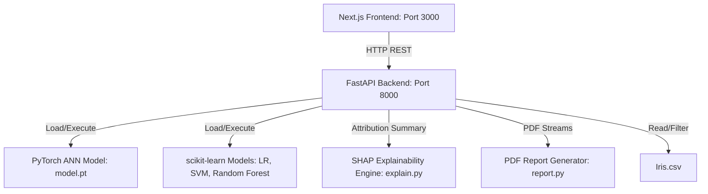

# IrisVision AI

**Intelligent Flower Species Classification Powered by Machine Learning.**

IrisVision AI is a production-grade ML engineering showcase app designed to demonstrate core competencies across Backend Engineering (FastAPI, Python), Machine Learning and Explainable AI (PyTorch, scikit-learn, SHAP), Frontend Visualization (Next.js, Tailwind CSS, Framer Motion, Recharts), and DevOps/Deployment (Docker, Docker Compose).

---

## 🏗️ Architecture Diagram

The system employs a decoupled, client-server architecture serving predictions and explainability details in real-time.



---

## 🚀 Key Features

1. **Multi-Model Leaderboard:** Compare test metrics (Accuracy, Precision, Recall, F1-Score, Training time) across **Logistic Regression**, **Support Vector Machine (SVM)**, **Random Forest**, and a **PyTorch Dense Neural Network (ANN)**.
2. **Explainable AI (XAI):** Compute live local Shapley attributions using **SHAP KernelExplainer**. Renders interactive waterfall and force-plot attribution diagrams dynamically in the React frontend.
3. **Training Dashboard:** Hyperparameter optimization controller allowing users to adjust learning rate and epoch sizing, trigger live retraining, and plot gradient descent cross-entropy loss curve decays.
4. **Advanced Analytics:** Explore Pearson Feature Correlation heatmaps, multi-class confusion matrices, Receiver Operating Characteristic (ROC) threshold splits, and Precision-Recall (PR) curves.
5. **Real-time Dataset Explorer:** Browse, search, filter, and page through the 150 rows of Fisher's Iris database.
6. **Download PDF Reports:** Compile predictions, probability distributions, local SHAP attributions, and decision insights into a downloadable vector PDF report generated via ReportLab.

---

## 🛠️ REST API Documentation

### 1. Model Inference
* **Endpoint:** `POST /predict`
* **Request Body:**
  ```json
  {
    "sepal_length": 5.1,
    "sepal_width": 3.5,
    "petal_length": 1.4,
    "petal_width": 0.2,
    "model_name": "Neural Network"
  }
  ```
* **Response:**
  ```json
  {
    "predicted_species": "Iris-setosa",
    "predicted_idx": 0,
    "confidence": 0.999,
    "probabilities": { "Iris-setosa": 0.999, "Iris-versicolor": 0.001, "Iris-virginica": 0.000 },
    "shap_values": { "Iris-setosa": { "Sepal Length": 0.031, "Sepal Width": 0.001, "Petal Length": 0.321, "Petal Width": 0.320 }, ... },
    "base_values": { "Iris-setosa": 0.325, ... }
  }
  ```

### 2. Retraining Workspace
* **Endpoint:** `POST /train`
* **Request Body:**
  ```json
  {
    "epochs": 100,
    "lr": 0.005
  }
  ```
* **Response:** Retrains all models, logs neural training loss arrays, and returns metrics caches.

### 3. Analytics & Exploration
* **Endpoint:** `GET /advanced-analytics`
  Returns ROC/PR curves, Confusion Matrix, and Pearson Correlation values.
* **Endpoint:** `GET /dataset`
  Query params: `page`, `page_size`, `search`, `sort_by`, `sort_order`, `species_filter`. Returns paginated lists.
* **Endpoint:** `POST /generate-report`
  Accepts prediction details and returns a PDF stream download.

---

## 📦 Getting Started

### Method A: Docker Compose (Recommended)
Build and run both client and server containers automatically:
```bash
docker-compose up --build
```
* **Frontend:** [http://localhost:3000](http://localhost:3000)
* **Backend API Docs:** [http://localhost:8000/docs](http://localhost:8000/docs)

### Method B: Manual Local Setup
#### 1. Start the Backend
1. Navigate to directory: `cd backend`
2. Create and activate venv: `python -m venv venv && source venv/bin/activate`
3. Install libraries: `pip install -r requirements.txt`
4. Run FastAPI: `uvicorn main:app --port 8000 --reload`

#### 2. Start the Frontend
1. Navigate to directory: `cd frontend`
2. Install packages: `npm install`
3. Launch development server: `npm run dev`
